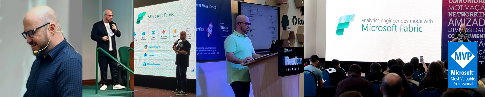

  

## About me  

🎖️ Microsoft MVP Data Platform focused on Microsoft Fabric  
👨🏼‍🏫 Microsoft Certified Trainer (MCT)    
🚀 Content Creator on [YouTube](https://www.youtube.com/@alisonpezzott)  and [LinkedIn](https://www.linkedin.com/in/alisonpezzott/)    

> I'm a Brazilian data professional passionate about Microsoft technologies, data engineering and analytics. My mission is to democratize knowledge about Microsoft Fabric and Power BI with simplicity, depth, and clarity, sharing practical and real-world solutions.  

  

## 🛠️ My Toolbox

  
  
  
  
  
  
  
  

 
## 📊 My Stats  

  
  

  

## ⭐ Top Repositories

  
  
  
  
  
  
  

## 🎥 Recent Videos  

<!-- BEGIN YOUTUBE-CARDS -->

[![[POWER BI] Gráfico de colunas empilhadas customizado com DAX](https://ytcards.demolab.com/?id=KJq296OjUqw&title=%5BPOWER+BI%5D+Gr%C3%A1fico+de+colunas+empilhadas+customizado+com+DAX&lang=en&timestamp=1750242351&background_color=%230d1117&title_color=%23ffffff&stats_color=%23dedede&max_title_lines=2&width=250&border_radius=5 "[POWER BI] Gráfico de colunas empilhadas customizado com DAX")](https://www.youtube.com/watch?v=KJq296OjUqw)
[![[Microsoft Fabric] Como trocar a região da capacidade](https://ytcards.demolab.com/?id=5Xuin4yVz5Y&title=%5BMicrosoft+Fabric%5D+Como+trocar+a+regi%C3%A3o+da+capacidade&lang=en&timestamp=1748944803&background_color=%230d1117&title_color=%23ffffff&stats_color=%23dedede&max_title_lines=2&width=250&border_radius=5 "[Microsoft Fabric] Como trocar a região da capacidade")](https://www.youtube.com/watch?v=5Xuin4yVz5Y)
<!-- END YOUTUBE-CARDS -->

## 📝 Recent Articles  

[Manipulating a Delta Table in a Lakehouse (Disconnected from Notebook) Using Python (Not PySpark) in Microsoft Fabric](https://www.linkedin.com/pulse/manipulating-delta-table-lakehouse-disconnected-from-notebook-alison-jfyyf/?trackingId=UxsVtBhLTzeNzuYammFkrQ%3D%3D)  

[Automating Power BI Documentation: Introducing PBI-DOCS](https://www.linkedin.com/pulse/automating-power-bi-documentation-introducing-pbi-docs-alison-pezzott-omvkf/?trackingId=QpgtJB2IQsuUEuajt7j%2BCw%3D%3D)  

[CI/CD com Microsoft Fabric na prática | AzureDevOps | YAML | Fabric REST APIs](https://www.linkedin.com/pulse/cicd-com-microsoft-fabric-na-pr%25C3%25A1tica-azuredevops-yaml-alison-pezzott-clbrf/?trackingId=QpgtJB2IQsuUEuajt7j%2BCw%3D%3D)  

[Explorando a Arquitetura Medallion com Microsoft Fabric](https://www.linkedin.com/pulse/explorando-arquitetura-medallion-com-microsoft-fabric-alison-pezzott-ptdjf/?trackingId=QpgtJB2IQsuUEuajt7j%2BCw%3D%3D)  
