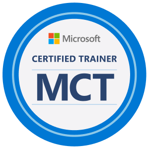

  

## About me  

  
  

> ### I'm a Brazilian data professional passionate about Microsoft technologies, data engineering and analytics. My mission is to democratize knowledge about Microsoft Fabric and Power BI with simplicity, depth, and clarity, sharing practical and real-world solutions.
 
## 📊 My Stats  

  
  

  

## ⭐ Top Repositories

  
  
  
  
  
  
  
  

  

## 🎥 Recent Videos  

<!-- BEGIN YOUTUBE-CARDS -->

<!-- END YOUTUBE-CARDS -->

## 📝 Recent Articles  

[Manipulating a Delta Table in a Lakehouse (Disconnected from Notebook) Using Python (Not PySpark) in Microsoft Fabric](https://www.linkedin.com/pulse/manipulating-delta-table-lakehouse-disconnected-from-notebook-alison-jfyyf/?trackingId=UxsVtBhLTzeNzuYammFkrQ%3D%3D)  

[Automating Power BI Documentation: Introducing PBI-DOCS](https://www.linkedin.com/pulse/automating-power-bi-documentation-introducing-pbi-docs-alison-pezzott-omvkf/?trackingId=QpgtJB2IQsuUEuajt7j%2BCw%3D%3D)  

[CI/CD com Microsoft Fabric na prática | AzureDevOps | YAML | Fabric REST APIs](https://www.linkedin.com/pulse/cicd-com-microsoft-fabric-na-pr%25C3%25A1tica-azuredevops-yaml-alison-pezzott-clbrf/?trackingId=QpgtJB2IQsuUEuajt7j%2BCw%3D%3D)  

[Explorando a Arquitetura Medallion com Microsoft Fabric](https://www.linkedin.com/pulse/explorando-arquitetura-medallion-com-microsoft-fabric-alison-pezzott-ptdjf/?trackingId=QpgtJB2IQsuUEuajt7j%2BCw%3D%3D)  
